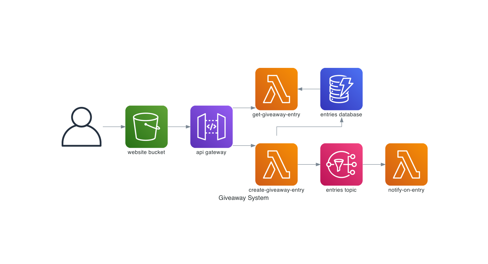

# giveaway-system

Custom giveaway system built using Cloud technologies. Used for learning serverless app development and Cloud (AWS).

**Application still in development**

## Perquisites

- [Node.js](https://nodejs.org/en/)
- [Yarn](https://yarnpkg.com/)
- [Python](https://www.python.org/)
- [Docker](https://www.docker.com/)

## Deployment

```bash
yarn api:deploy:dev     ## deploys api to dev stage
yarn api:remove         ## removes api deployment
yarn client:deploy      ## deploys client
yarn client:remove      ## removes client deployment
```

## Architecture



The app consists of two parts: client and api.
Client is a React.js app, built with Next.js, hosted on S3 which interacts with serverless API.
API is written in Python and uses AWS Lambda as a runtime.

[Decision Records](https://adr.github.io/) are stored in [docs/adr](docs/adr)

