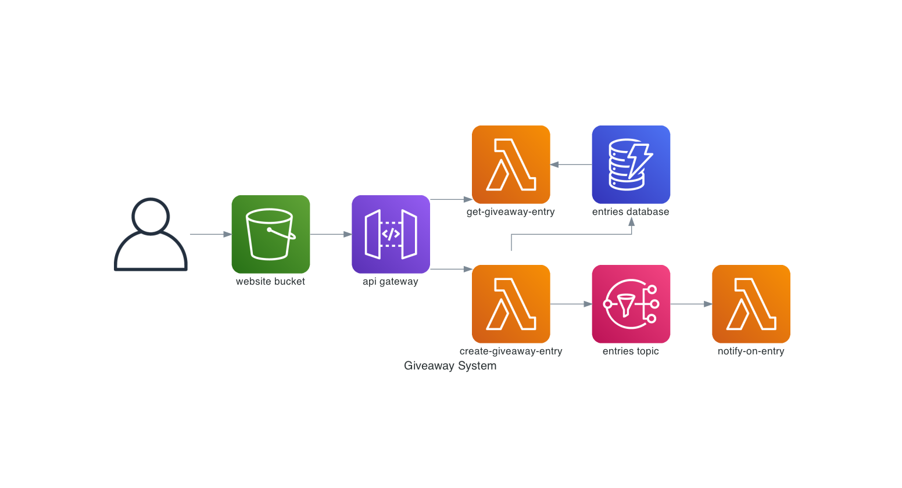

# giveaway-system

Custom giveaway system built using Cloud technologies. Used for learning serverless app development and Cloud (AWS).

## Perquisites

- [Node.js](https://nodejs.org/en/)
- [Yarn](https://yarnpkg.com/)
- [Python](https://www.python.org/)
- [Docker](https://www.docker.com/)

## Architecture

The app consists of two parts: client and api.
Client is a React.js app, built with Next.js, hosted on S3 which interacts with serverless API.
API is written in Python and uses AWS Lambda as a runtime.

Serverless approach was chosen as an API architecture because:

- it offers high availability and scalability
- it offers flexible pricing because client is charged only when the resources are used

AWS was chosen because:

- it offers large portfolio of services, used for building cloud services

Serverless Framework was chosen because:

- it eases the process of developmeny and deployment

